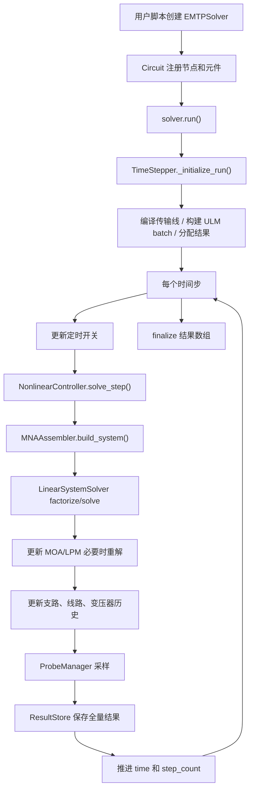

# EMTP 代码讲解

本文面向“读代码、改代码、定位问题”的场景，重点讲清这个 EMTP 项目的模块边界、仿真主链路、模型接入方式和案例脚本结构。它不是 API 使用手册；API 示例可继续参考 `EMTP_使用指南.md`，实现风险和改进项可参考 `EMTP_Code_Review.md`。

## 1. 项目定位

这个仓库实现的是一个基于 Python 的电磁暂态仿真器。核心数值框架是：

- 使用 MNA（Modified Nodal Analysis，修正节点分析）装配节点导纳矩阵。
- 使用隐式梯形法把 L、C、RL、变压器等动态元件离散成 Norton 等效。
- 使用 SuperLU 对稀疏 MNA 矩阵做 LU 分解，并在矩阵拓扑不变时复用分解。
- 使用 PSCAD 风格分段线性法处理 MOA 等非线性电阻。
- 支持 Bergeron 无损线、ULM 频变参数传输线、CIGRE LPM 绝缘子闪络模型、UMEC 变压器和 ATP 风格雷电流源。

运行时的基本形态是：

```text
用户脚本
  -> EMTPSolver 门面 API
     -> Circuit 注册拓扑和元件
     -> TimeStepper 管理时间步进
     -> MNAAssembler 装配/求解线性系统
     -> NonlinearController 处理 MOA/LPM 重解
     -> ResultStore / ProbeManager 保存结果
```

## 2. 目录结构

```text
emtp_0508/
├─ __init__.py                 # 对外导出 EMTPSolver、模型和测试注册表
├─ solver.py                   # EMTPSolver 门面类，保持旧 API 兼容
├─ core/
│  ├─ circuit.py               # 节点管理、元件/线路/变压器注册
│  ├─ mna_assembler.py         # MNA 矩阵和 RHS 装配、线性求解入口
│  ├─ nonlinear.py             # MOA 分段线性迭代、LPM 状态重解
│  ├─ sparse_solver.py         # SuperLU 封装和兼容求解器
│  ├─ time_stepper.py          # 主时间循环、运行时缓存、线路 batch 更新
│  └─ defaults.py              # 全局默认常量
├─ models/
│  ├─ devices.py               # R/L/C/Switch/SeriesRL/NonlinearResistor
│  ├─ components.py            # 旧 Branch 数据结构和 ElementType
│  ├─ device_protocol.py       # StampableDevice 等协议接口
│  ├─ sources.py               # 电流源、电压源数据结构
│  ├─ bergeron.py              # Bergeron 传输线和延时缓冲区
│  ├─ moa.py                   # 分段线性 MOA 和段切换检查器
│  ├─ lpm.py                   # CIGRE 先导发展法绝缘子闪络
│  ├─ lightning.py             # ATP TWOEXPF / HEIDLERF 雷电流源
│  ├─ transformer.py           # UMEC 三相组式变压器
│  └─ ulm/model.py             # FitULM 读写、ULM 模型、ULMLine、ULMBatchPack
├─ io/
│  ├─ probes.py                # 轻量探针注册、采样、读取
│  ├─ results.py               # 全量结果缓存和结果访问器
│  └─ reporting.py             # 仿真统计和耗时报表
├─ case/                       # 具体算例脚本和线路模型文件
└─ LCP/                        # 线路参数计算、矢量拟合、fitULM 生成相关脚本
```

`core/` 是仿真内核，`models/` 是物理模型，`io/` 是结果和探针，`case/` 是可运行场景，`LCP/` 更像离线建模工具链，用来生成或验证 ULM 所需的线路参数文件。

## 3. 对外入口：`EMTPSolver`

`solver.py` 中的 `EMTPSolver` 是用户主要接触的类。它现在更像一个 Facade：

- 构造时创建 `Circuit`、`ProbeManager`、`ResultStore`、`TimeStepper`、`Reporter`、`MNAAssembler`、`NonlinearController`。
- 对外保留 `add_R()`、`add_L()`、`add_C()`、`add_ulm_line()`、`run()`、`get_probe()` 等旧 API。
- 真正状态不再全部放在 `EMTPSolver` 自己身上，而是通过 `_FACADE_FIELD_OWNERS` 路由到各子系统。

典型调用：

```python
from emtp import EMTPSolver

solver = EMTPSolver(dt=1e-8, finish_time=1e-3, result_mode="probes_only")
solver.add_R("R1", "n1", "GND", 50.0)
solver.add_voltage_probe("V_n1", "n1", "GND")
solver.run()
v = solver.get_probe("V_n1", unit="kV")
```

读代码时要注意：如果看到 `solver.branches`、`solver._timing`、`solver._cached_MNA` 这类字段，不一定存放在 `solver.__dict__`，可能被 `__getattr__` 转发到 `Circuit`、`TimeStepper` 或 `MNAAssembler`。

## 4. 节点和拓扑：`Circuit`

`core/circuit.py` 负责拓扑注册。

### 4.1 `NodeBook`

`NodeBook` 把字符串节点名映射为整数节点号：

- `0`、`"GND"`、`"ground"` 都视为地。
- 字符串节点首次出现时自动分配从 1 开始的整数。
- 支持 `bind_node()` 手动绑定旧编号，也支持 `alias_node()` 创建别名。

MNA 内部只处理整数节点，结果接口和添加元件接口可以接受字符串节点。

### 4.2 元件注册

`Circuit` 中的注册函数会完成四件事：

1. 解析节点名。
2. 创建模型对象。
3. 写入拓扑容器，如 `branches`、`current_sources`、`voltage_sources`、`transmission_lines`。
4. 更新 `num_nodes` 并标记 MNA 矩阵失效。

主要入口如下：

| API | 创建对象 | 存放位置 |
|---|---|---|
| `add_R()` | `Resistor` | `circuit.branches` |
| `add_L()` | `Inductor` | `circuit.branches` |
| `add_C()` | `Capacitor` | `circuit.branches` |
| `add_series_RL()` | `SeriesRL` | `circuit.branches` |
| `add_SW()` | `Switch` | `circuit.branches` |
| `add_IS()` | `CurrentSource` | `circuit.current_sources` |
| `add_VS()` | `VoltageSource` | `circuit.voltage_sources` |
| `add_MOA_from_file()` | `NonlinearResistor + SegmentedMOAResistor` | `branches + seg_helper` |
| `add_insulator_LPM()` | `Switch + InsulatorFlashoverLPM` | `branches + _lpm_elements` |
| `add_bergeron_line()` | `BergeronLine` | `transmission_lines` |
| `add_ulm_line()` | `ULMLine` | `transmission_lines` |
| `add_UMEC_transformer()` | `UMECTransformer` | `transformers` |

`add_device()` 是扩展入口：只要新设备满足 `StampableDevice` 协议，就可以作为二端口支路加入 MNA。

## 5. 设备协议：`StampableDevice`

项目已经从早期的 `ElementType if-elif` 逐步迁移到协议式设备接口。核心协议在 `models/device_protocol.py`：

```text
get_conductance()      -> 对 G 矩阵的导纳贡献
has_history_source()   -> 是否需要向 RHS 注入历史电流源
get_history_current()  -> 当前历史源数值
compute_current(v)     -> 由当前支路电压计算支路电流
update_history(v, i)   -> 一步求解后推进历史状态
reset_state()          -> 重新运行前清零动态状态
```

因此 `MNAAssembler` 和 `TimeStepper` 不需要知道每个设备的具体类型，只调用协议方法即可。这也是后续增加新二端口模型最推荐的接入方式。

## 6. MNA 装配和求解

`core/mna_assembler.py` 管理 MNA 线性系统：

```text
[ G  B ] [ v  ] = [ I ]
[ C  0 ] [ iS ]   [ E ]
```

- `G` 是节点导纳矩阵。
- `B/C` 是理想电压源引入的增广约束。
- `v` 是节点电压。
- `iS` 是理想电压源电流。
- `I` 是电流源、历史源、线路历史源、变压器历史源组成的 RHS。
- `E` 是理想电压源激励。

### 6.1 `build_matrix()`

矩阵只在拓扑或等效导纳变化时重建：

- 普通支路按二端口导纳邮票法 stamp 到 `G`。
- 传输线只在 k-k、m-m 端口 stamp 自导纳，端口间耦合通过历史源体现。
- UMEC 变压器按多端口 Norton 导纳矩阵 stamp 四个象限。
- 理想电压源把 `+1/-1` stamp 到增广行列。

### 6.2 `build_rhs()`

RHS 每一步都会重建：

- 动态支路注入 `Ihist`。
- 独立电流源按当前时间 `source.current_at(time)` 注入。
- 传输线注入 `I_hist_k/I_hist_m`。ULM batch 模式下直接从 batch 数组读。
- 变压器注入多端口历史电流。
- 理想电压源把 `voltage_at(time)` 写到增广 RHS。

### 6.3 求解缓存

`LinearSystemSolver` 使用 `scipy.sparse.linalg.splu()`。当 `_G_dirty=False` 时：

- MNA 矩阵不重建。
- LU 分解不重新做。
- 每步只更新 RHS 并回代。

矩阵奇异时会先尝试一个很小的对角正则项。若仍失败，只有在 `allow_dense_fallback=True` 且矩阵阶数不超过 `dense_fallback_max_size` 时才回退到 dense `np.linalg.lstsq()`；大系统会直接抛出 `MatrixSingularError` 并给出诊断信息。

## 7. 单步求解：`NonlinearController`

`core/nonlinear.py` 负责把“线性求解”和“状态相关重解”包起来。

每个时间步的求解入口是 `solve_step()`：

1. 如果电路含 MOA 等分段非线性元件，调用 `solve_segmented()`。
2. 否则直接调用 `MNAAssembler.solve_current_system()`。
3. 如果含 LPM 绝缘子，求解后根据电压和电流更新 LPM 状态。
4. 如果 LPM 开关状态改变，标记矩阵失效并重解当前时间步。

MOA 分段线性法的关键是：

- 先用当前段的 Norton 等效求解。
- 根据求出的元件端电压检查是否跨段。
- 如果跨段或 `i_eq` 因电压符号改变而变化，则更新该支路 `Geq/Ihist`。
- 标记矩阵失效并重新求解。
- 最大迭代次数由 `MAX_SEG_ITER` 控制。

## 8. 时间主循环：`TimeStepper`

`core/time_stepper.py` 是整个仿真的调度器。

### 8.1 初始化阶段

`run()` 调用 `_initialize_run()`，主要做：

1. 如果不是续算，并且 solver 已经运行过，则重置动态状态。
2. 分配结果数组和探针数组。
3. 重置矩阵缓存、统计量、耗时累计。
4. 编译传输线运行时状态。
5. 为 ULM 创建 batch 运行时。
6. 预编译每步需要处理的支路列表，减少空循环。
7. 准备电压源顺序表。

### 8.2 每步执行顺序

核心流程在 `_run_single_step()`：

```text
1. update timed switches
2. solve MNA / nonlinear / LPM
3. update branch voltage/current
4. update transmission-line states
5. record probes
6. update branch history sources
7. update transformer history
8. store full results if enabled
9. time += dt
```

注意探针是在动态支路历史源推进之前采样的。这样 L/C/RL 的支路电流使用的是本步求解所对应的 `Ihist`，不会误采到下一步历史源。

### 8.3 续算和重跑

默认 `solver.run()` 是可重入的：同一个 solver 第二次运行会重置动态状态。如果想从当前状态继续，必须显式传入：

```python
solver.run(continue_from_current_state=True)
```

## 9. 基本元件模型

基本元件位于 `models/devices.py`。

### 9.1 R

`Resistor` 没有历史源：

```text
G = 1 / R
i = G * v
```

### 9.2 L

`Inductor` 使用隐式梯形离散：

```text
G_eq = dt / (2L)
i = G_eq * v + I_hist
I_hist(next) = I_hist + 2 * G_eq * v
```

可选 `Rp` 作为并联阻尼导纳加入 `get_conductance()`，但不进入电感历史源递推。

### 9.3 C

`Capacitor` 使用隐式梯形离散：

```text
G_eq = 2C / dt
i = G_eq * v + I_hist
I_hist(next) = -I_hist - 2 * G_eq * v
```

### 9.4 SeriesRL

`SeriesRL` 把串联 R-L 合成一个二端口 Norton 等效，不引入内部节点：

```text
G_L = dt / (2L)
denom = 1 + R * G_L
G_eq = G_L / denom
I_eq = I_hist_L_raw / denom
```

历史更新时先还原内部电感电压：

```text
v_L = v_branch - R * i_branch
I_hist_L_raw(next) = I_hist_L_raw + 2 * G_L * v_L
```

### 9.5 Switch

`Switch` 通过 `R_closed/R_open` 在导通和开断之间切换。定时开关由 `update_time(t)` 检查 `t_close/t_open`，若状态改变则触发矩阵重建。

LPM 绝缘子也复用 `Switch` 作为电路中的二端口开关，只是开关状态由 LPM 模型控制。

## 10. 电源模型

`models/sources.py` 只有很薄的数据结构：

- `CurrentSource.current_at(t)` 返回独立电流源瞬时值。
- `VoltageSource.voltage_at(t)` 返回理想电压源瞬时值。

`add_IS()` 支持三种输入：

- 可调用函数 `lambda t: ...`
- 常数
- `BaseLightningCurrentSource` 子类对象

雷电流源位于 `models/lightning.py`，支持：

- `TWOEXPFCurrentSource`
- `HEIDLERFCurrentSource`
- 标准波形库，如 `"8/20"`、`"2/20"`、`"10/350"` 等
- 自动拟合或直接给定 `tau1/tau2`、`A/B`、`Tf/tau`

案例脚本中的兼容方法 `add_standard_twoexpf_IS()` 不在 `EMTPSolver` 主类中，而是在 `case/emtp_fixed_case_compat.py` 里给旧案例动态补上的。

## 11. 传输线模型

### 11.1 Bergeron

`models/bergeron.py` 实现无损 Bergeron 线：

```text
G_eq = 1 / Zc
I_k = G_eq * V_k + I_hist_k
I_m = G_eq * V_m + I_hist_m
e = V + Zc * I
I_hist_k(t) = -e_m(t - tau) / Zc
I_hist_m(t) = -e_k(t - tau) / Zc
```

`DelayBuffer` 用环形缓冲区保存行波变量，并支持非整数 `tau/dt` 的线性插值。

### 11.2 ULM

ULM 频变线路是代码量最大的模块，位于 `models/ulm/model.py`。它分为几层：

| 类/函数 | 责任 |
|---|---|
| `FitULMData` | 保存拟合后的 Yc/H 极点、留数、延时 |
| `FitULMReader` / `FitULMWriter` | 读写 `.fitULM` / `.pch` 风格数据 |
| `ULMModel` | 把频域拟合数据离散成时域递归卷积模型 |
| `ULMLine` | 适配 EMTP 线路接口，暴露 `G_eq` 和历史源 |
| `ULMBatchPack` | 多条 ULM 线路批量更新，减少 Python 循环和对象访问 |

ULM 的导纳矩阵来自特征导纳 `Yc(s)` 的递归卷积离散。传播函数 `H(s)` 的延时和极点留数通过历史缓冲区进入历史电流源。

`TimeStepper` 会在 `_build_ulm_batch_runtime()` 中自动判断是否启用 batch：

- 少于 2 条 ULM 线或 `ulm_batch_mode="off"`：逐线更新。
- `ulm_batch_mode="serial"`：使用 batch 数组和 Numba serial kernel。
- `ulm_batch_mode="parallel"`：使用 Numba parallel kernel。
- `ulm_batch_mode="auto"`：根据线数和线程数自动选择。

在大算例中，`result_mode="probes_only"` 和 ULM batch 是主要性能路径。

### 11.3 LCP 到 ULM 的集成

现在 ULM 有两条入口：

- `add_ulm_line()`：直接读取已有 `.fitULM` / `.pch` 文件。
- `add_lcp_ulm_line()` 及其便捷方法：先调用 `models/lcp.py` 中的适配层，让 `LCP` 根据线路参数生成 fitULM，再回到同一条 `add_ulm_line()` 路径。

便捷方法包括：

| 方法 | LCP 线路类型 |
|---|---|
| `add_lcp_ohl_line()` | 架空线 |
| `add_lcp_single_core_cable_line()` | 单芯铠装电缆 |
| `add_lcp_three_core_cable_line()` | 三芯电缆 |

调用链可以拆成四步：

1. 用户脚本把 `nodes_k/nodes_m`、`length`、`line_type` 和线路参数传给 `add_lcp_ulm_line()`。
2. `Circuit.add_lcp_ulm_line()` 调用 `models/lcp.py::generate_lcp_fitulm()`。
3. `models/lcp.py` 根据 `line_type` 选择 LCP 计算路径：架空线、单芯铠装电缆或三芯管型电缆；先计算 `Z/Y`，再做 Vector Fitting 并写出 fitULM。
4. `Circuit.add_lcp_ulm_line()` 再把生成的 fitULM 路径交给原有 `add_ulm_line()`，所以后续时间域仿真仍走同一套 ULM 求解逻辑。

`config` 可以是配置对象，也可以是字典。当前 `lcp_case/` 更推荐把参数直接写成字典常量，例如：

- 架空线：`PHASE_POSITIONS`、`GROUND_WIRE_POSITIONS`、`ground_resistivity`、`phase_radius`、`phase_dc_resistance`。
- 单芯电缆：`SINGLE_CORE_CABLE_BASE` 和 `LCP_FIT_CONFIG["cables"]`，每根电缆包含芯线、绝缘、护套、铠装、外护套、埋深和水平位置。
- 三芯电缆：`LCP_FIT_CONFIG` 直接给出三芯角度、距管中心距离、管道半径、芯线/护套/绝缘参数和土壤参数。

生成文件默认带参数 hash；正式批量算例可以复用缓存。教学和调参案例则统一使用 `LCP_FORCE_REBUILD=True`，避免 `generated_lcp/` 中的旧 fitULM 影响当前参数结果。

这个设计让 LCP 仍然保持为线路参数/矢量拟合工具箱，时间域求解器只消费最终 fitULM 模型；边界比较干净，后续改 LCP 几何或拟合算法时不会牵动 MNA 和 TimeStepper。

## 12. 非线性和闪络模型

### 12.1 MOA

`models/moa.py` 中的 `SegmentedMOAResistor` 把 V-I 曲线离散成若干线性段：

```text
I = g * |V| + I_offset
```

MNA 中实际 stamp 的是当前段的 Norton 等效：

```text
I = g * V + i_eq
```

`SegmentedSolverHelper` 同时跟踪段号和 Norton 等效。当电压绝对值没跨段，但电压符号改变导致 `i_eq` 变号时，也会触发重解。

### 12.2 LPM 绝缘子

`models/lpm.py` 实现 CIGRE 先导发展法：

```text
E_gap = u_eff / (d - l)
v = k * 1e6 * u_eff * (E_gap - E0_eff)
l(next) = l + v * dt
```

当 `l >= d` 时，绝缘子闪络，对应电路支路从 `R_open` 切换为 `R_arc`。如果启用 `allow_extinction`，电弧电流低于阈值并持续指定时间后会重新开断。

`NonlinearController.update_lpm_states()` 在每步求解后读取绝缘子端电压，调用 LPM 更新状态。如果状态改变，则重建矩阵并重解当前步。

## 13. UMEC 变压器

`models/transformer.py` 实现三相组式 UMEC 模型。当前实现假设三相组由三台独立单相变压器构成，各相之间没有磁耦合。

主要步骤：

1. 根据额定线电压和接法计算相电压。
2. 根据空载电流估算磁导。
3. 构造多绕组电感矩阵和电阻矩阵。
4. 用隐式梯形法离散：

```text
Z_eq = 2L/dt + R
G_eq = inv(Z_eq)
H = G_eq * (2L/dt - R)
i(t) = G_eq * V(t) + I_hist(t)
```

5. MNA 中按多端口 Norton 等效 stamp。
6. 每步结束后根据端口电压更新 `I_hist` 和磁链。

饱和模型已经有代码路径，但主时间循环目前只调用 `update_history()`，没有在 MNA 步中显式做变压器饱和段切换重解；如果要依赖饱和，需要进一步检查和补齐调用链。

## 14. 结果与探针

项目有两套结果路径：

从本轮优化开始，`EMTPSolver` 的默认行为已经切换为低内存路径：

```python
EMTPSolver(
    result_mode="probes_only",
    record_node_history=False,
    record_branch_history=False,
    record_line_history=False,
)
```

也就是说，大多数算例应显式注册 probe，再用 `get_probe()` 读取结果。如果需要调试小系统并读取全节点电压历史，请显式使用：

```python
solver = EMTPSolver(result_mode="full", record_node_history=True)
```

### 14.1 全量历史：`ResultStore`

`io/results.py` 保存：

- 时间数组
- 全节点电压历史
- 电压源电流
- 支路电压/电流
- 线路端口历史
- LPM 历史和闪络日志

全量结果适合小系统调试，但大系统很耗内存。

### 14.2 轻量探针：`ProbeManager`

`io/probes.py` 保存显式注册的观测量：

- `add_voltage_probe()`：节点间电压
- `add_branch_current_probe()`：支路电流
- `add_line_current_probe()`：线路端口指定相电流

`result_mode="probes_only"` 会关闭全局节点电压历史，只保留时间和探针数据。案例脚本基本都采用这个模式。

重要约束：如果 `record_node_history=False`，就不要用 `get_node_voltage()` 取节点电压，应提前注册电压探针并用 `get_probe()` 读取。

## 15. 案例脚本怎么读

`case/` 目录里的脚本不是内核的一部分，但展示了当前 API 的推荐用法。

### 15.1 `emtp_fixed_case_compat.py`

这是旧案例兼容层：

- 自动把当前源码包加载为 `emtp`。
- 忽略旧 solver 构造参数。
- 给 `EMTPSolver` 补上旧接口 `add_standard_twoexpf_IS()`。

因此很多案例是：

```python
from emtp_fixed_case_compat import EMTPSolver
```

不是直接：

```python
from emtp import EMTPSolver
```

### 15.2 `DC_CABLE_TEST_0201_probe_fast.py` / `strict.py`

这是一条 6 相/6 导体 ULM 直流电缆雷击算例：

- 使用 `cable_model_100km.pch`。
- 使用 `add_ulm_line("TL_6ph", ...)` 加入线路。
- 使用 ATP 双指数 `"2/20"` 雷电流源。
- 使用 `add_voltage_probe()` 记录端口电压。
- 优先使用 `add_line_current_probe()` 记录 port-7 电流。
- 输出图像和 `port7_data.txt`。

`fast` 版本偏运行效率和兼容回退；`strict` 版本更强调严格 probe-only 路径。

`lcp_case/lcp_DC_CABLE_TEST_0201_probe_fast.py` 和 `lcp_case/lcp_DC_CABLE_TEST_0201_probe_strict.py` 是对应的 LCP 参数生成版。它们不再读取 `cable_model_100km.pch`，而是在脚本中展开单芯铠装电缆参数：

- `CORE_RADIUS`、`INSULATION_RADIUS`、`SHEATH_OUTER_RADIUS`、`ARMOR_OUTER_RADIUS`、`JACKET_RADIUS` 描述半径和层厚。
- `SINGLE_CORE_CABLE_BASE` 描述芯线、绝缘、护套、铠装、外护套的电阻率、相对介电常数、相对磁导率和埋深。
- `LCP_FIT_CONFIG["cables"]` 给出两根单芯电缆的水平位置：`horizontal_pos=-6.0` 和 `horizontal_pos=6.0`。
- `LCP_FORCE_REBUILD=True`，每次运行都会按当前参数重新生成 fitULM。

核心调用是：

```python
line = solver.add_lcp_ulm_line(
    name="TL_6ph",
    nodes_k=nodes_k,
    nodes_m=nodes_m,
    line_type="single_core_cable",
    length=LINE_LENGTH,
    output_dir=LCP_OUTPUT_DIR,
    force_rebuild=LCP_FORCE_REBUILD,
    **LCP_FIT_CONFIG,
)
```

### 15.3 `cascaded_cable_6seg_probe_latest.py`

这是 6 段 ULM 电缆串联算例：

- 每段使用同一个 `cable_model_20km.pch`。
- 每段有 `[C+, S+, A+, C-, S-, A-]` 六个导体节点。
- 护套和铠装在每段两端独立接地。
- 启用 `ulm_batch_mode="auto"`，多条 ULM 线会走 batch 路径。
- 所有输出电压通过 probe 采样。

需要留意：脚本常量里 `SEG_LENGTH = 20e3`，`N_SEG = 6`，按计算总长是 120 km；但部分标签数组和注释仍保留 0、100、200 ... 600 km 的文案。做严肃结果解释前应确认这里的物理长度标注是否已经同步。

`lcp_case/lcp_cascaded_cable_6seg_probe_latest.py` 是级联电缆的 LCP 参数生成版。它复用同一套 `SINGLE_CORE_CABLE_BASE` 和 `LCP_FIT_CONFIG["cables"]`，但在每一段循环里调用 `add_lcp_ulm_line()`：

```python
for seg in range(1, N_SEG + 1):
    line = solver.add_lcp_ulm_line(
        name=f"Cable_{seg}",
        nodes_k=CABLE_NODES[seg]["k"],
        nodes_m=CABLE_NODES[seg]["m"],
        line_type=LCP_LINE_TYPE,
        length=SEG_LENGTH,
        output_dir=LCP_OUTPUT_DIR,
        force_rebuild=LCP_FORCE_REBUILD,
        **LCP_FIT_CONFIG,
    )
```

由于 `LCP_FORCE_REBUILD=True`，每段添加时都会要求 LCP 重新生成模型。后续如果性能上希望只生成一次再复用，可以先用单独脚本生成 fitULM，或者把 `force_rebuild` 调回 `False` 并确认参数已经稳定。

### 15.4 `emtp_multiphase_verification_*`

这些脚本用于多相线路验证，结构和 DC cable 案例类似，主要用于确认多相 ULM、探针和结果路径是否正常。

`lcp_case/lcp_emtp_multiphase_verification_probe_fast.py` 和 `lcp_case/lcp_emtp_multiphase_verification_probe_strict.py` 是架空线 LCP 参数生成版。它们把导线坐标直接放在案例顶部：

```python
PHASE_POSITIONS = [
    (-11.777, 48.0 - 9.2 * 2 / 3),
    (11.777, 48.0 - 9.2 * 2 / 3),
]
GROUND_WIRE_POSITIONS = [
    (-19.25, 63.0 - 6.1 * 2 / 3),
    (19.25, 63.0 - 6.1 * 2 / 3),
]
```

然后在 `LCP_FIT_CONFIG` 中给出土壤电阻率、导线半径、直流电阻、分裂数、分裂间距、Kron 消元开关和拟合极点数。这里的架空线模型使用的是 `phase_dc_resistance` / `gw_dc_resistance`，单位为欧姆/km，不是材料电阻率。

### 15.5 `lcp_three_core_cable_explicit_config_case.py`

这是新增的三芯管型电缆显式参数案例，主要用于展示便捷方法 `add_lcp_three_core_cable_line()`。导体顺序为：

```text
Core1, Sheath1, Core2, Sheath2, Core3, Sheath3, Pipe
```

案例顶部的 `LCP_FIT_CONFIG` 直接包含：

- 管道参数：`pipe_inner_radius`、`pipe_outer_radius`、`pipe_rho`、`pipe_mu_r`、`jacket_radius`。
- 管内三根单芯的位置：`cable_angles_deg`、`distance_from_center`。
- 单芯参数：`core_radius`、`core_rho`、`insulation_radius`、`sheath_outer_radius`、`outer_insulation_radius`。
- 土壤参数：`ground_resistivity`、`ground_permeability`、`ground_permittivity`。

它的调用比通用方法更短，因为便捷方法已经固定了 `line_type="three_core_cable"`：

```python
line = solver.add_lcp_three_core_cable_line(
    name="TL_three_core",
    nodes_k=NODES_K,
    nodes_m=NODES_M,
    length=LINE_LENGTH,
    output_dir=LCP_OUTPUT_DIR,
    force_rebuild=LCP_FORCE_REBUILD,
    **LCP_FIT_CONFIG,
)
```

## 16. LCP 目录的角色

`LCP/` 不是时间域 EMTP 主循环的一部分，更像线路参数计算和 ULM 文件生成工具箱：

- `cable_model.py`：电缆几何和参数计算。
- `ulm_atp_zy_deri_semlyen.py`：架空线 Z/Y 计算。
- `vector_fitting_v411_independent.py`、`vectfit3.py`、`vf_core.py`：矢量拟合。
- `clean_test/`：去掉 PSCAD 对比后的核心计算脚本。
- `test/`：含 PSCAD 读取、对比、绘图和误差统计的完整验证脚本。

时间域仿真主要消费 LCP 生成的 `.fitULM` / `.pch` 文件。现在有两种消费方式：

- 旧方式：先用 LCP/clean_test 或外部工具生成文件，再在案例中调用 `add_ulm_line(fitulm_file=...)`。
- 新方式：在案例中直接写几何和材料参数，调用 `add_lcp_ulm_line()` 或三类便捷方法，由求解器自动生成并加载 fitULM。

`lcp_case/generated_lcp/` 和 `case/generated_lcp/` 都是自动生成目录，不应作为源码维护。参数调试阶段优先设置 `force_rebuild=True`；参数稳定后才考虑复用缓存。

## 17. 一张调用链图



## 18. 扩展新模型的建议路径

### 18.1 新二端口元件

实现 `StampableDevice` 所需方法，然后调用：

```python
solver.circuit.add_device(my_device)
```

或在 `Circuit` 中增加一个 `add_xxx()` 包装方法。

最少需要：

- `name`
- `node_from`
- `node_to`
- `get_conductance()`
- `has_history_source()`
- `get_history_current()`
- `compute_current(v_branch)`
- `update_history(v_branch, i_branch)`
- `reset_state()`

### 18.2 新传输线模型

实现类似 `TransmissionLineInterface` 的对象：

- `name`
- `node_k/node_m` 或 `nodes_k/nodes_m`
- `G_eq`
- `I_hist_k/I_hist_m`
- `initialize(dt)`
- `update_history_sources()`
- `update_state(V_k, V_m, record_history=True)`
- `get_info()`

然后用：

```python
solver.add_line(line)
```

### 18.3 新结果采样

优先扩展 `ProbeManager`，而不是默认打开全量历史。对大规模 ULM 算例，probe-only 是更稳的路径。

## 19. 常见定位线索

| 现象 | 优先检查 |
|---|---|
| `get_node_voltage()` 报未记录 | 是否设置了 `result_mode="probes_only"` 或 `record_node_history=False` |
| MNA 矩阵奇异 | 是否有浮空节点、理想电压源冲突、开路支路过多 |
| 仿真突然变慢 | 是否小矩阵触发 dense `lstsq()` 回退，或打开了全量节点/线路历史 |
| ULM 内存大 | 是否开启 `record_line_history=True`，是否可以用 line-current probe 替代 |
| MOA 结果跳变 | 检查分段 V-I 数据连续性和 `MAX_SEG_ITER` 是否足够 |
| LPM 闪络不发生 | 检查端电压单位、`gap_length`、`E0`、海拔修正和电源极性 |
| 案例 import 失败 | 从 `case/` 运行时使用 `emtp_fixed_case_compat.py`，或从包父目录运行 |

## 20. 已落地的优化项

本轮已先完成第一阶段中的低风险诊断和保护项：

- 默认 `EMTPSolver` 改为 `probes_only`，全节点电压历史默认关闭。
- `LinearSystemSolver` 增加 `allow_dense_fallback` 和 `dense_fallback_max_size`，默认只允许 300 阶及以下矩阵进入 dense `lstsq` 回退。
- 大矩阵 SuperLU/正则化失败时抛出 `MatrixSingularError`，错误信息包含矩阵规模、非零元数量和常见排查方向。
- `Reporter` 统计矩阵 build、LU factorization、RHS build、linear solve、dense fallback、switch event、MOA/LPM 重解次数。
- timing report 增加 `matrix_build`、`rhs_build`、`factorization`、`linear_solve`、`dense_fallback_solve`、`ulm_batch_update`、`line_fallback_update` 等细分项。

## 21. 阅读顺序建议

如果是第一次接手，推荐按这个顺序读：

1. `solver.py`：看门面如何把子系统接起来。
2. `core/circuit.py`：看节点、元件、线路如何入网。
3. `models/devices.py`：理解普通支路协议。
4. `core/mna_assembler.py`：理解矩阵和 RHS。
5. `core/nonlinear.py`：理解 MOA 和 LPM 的重解逻辑。
6. `core/time_stepper.py`：理解每一步仿真的执行顺序。
7. `io/probes.py`、`io/results.py`：理解结果为什么有 full 和 probe-only 两种模式。
8. `models/ulm/model.py`：最后再看 ULM，因为它是最复杂的性能模块。
9. `case/*.py`：结合实际算例看 API 如何被组织成工程场景。

这套代码的主线并不在单个巨大函数里，而是“设备协议 + MNA 装配 + 时间步调度 + 可选非线性重解”。抓住这四件事，后续看 MOA、LPM、ULM、UMEC 都会更容易定位它们在仿真循环中的位置。
